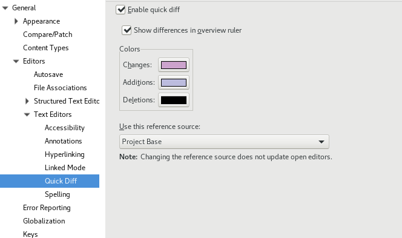

# eclipse-plugins-extras
Extra extensions for eclipse IDE to make it more usable.

## Features
### Project Extras

- Closing selected project and its hierarchy 
- Deleting selected project and its hierarchy 

### Project Quick Diff
Support project base quick diff which will change the quick diff based on project's Team Provider.

#### Supported Team Providers
- Subclipse
- EGit

### Static Imports

Adds java static imports for
- Guava
- Java Collection
- Java 8

### Quick Assist
- Support for `String.format`

### Debug Extras
- Dump Variable

    This feature adds support to dump a selected variable from debug variable view as a JSON file.

    

## Update site
[https://dl.bintray.com/gayanper/p2/eclipse-plugins-extras](https://dl.bintray.com/gayanper/p2/eclipse-plugins-extras)
